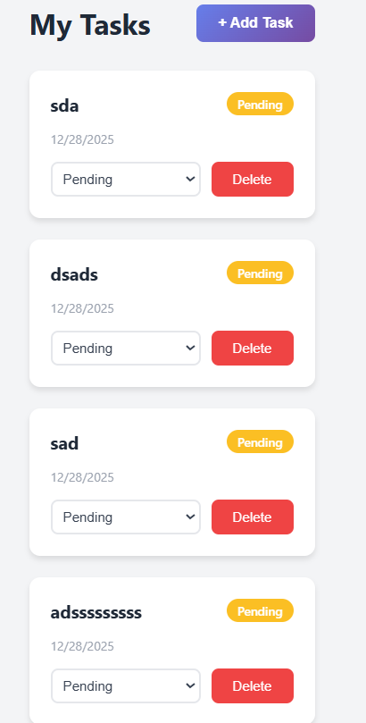

# Task Management Application

A full-stack task management application built with Express.js and React, featuring user authentication and full CRUD operations for tasks.

## Screenshots

### Task Page


### Login Page


### Task Management Dashboard


## Features

- **User Authentication**
  - User registration with password hashing
  - User login with JWT tokens
  - Protected routes and endpoints

- **Task Management**
  - Create tasks with title and optional description
  - View all user tasks
  - Update task status (pending, in_progress, done)
  - Delete tasks
  - Users can only access their own tasks

- **Modern UI**
  - Clean and responsive design
  - Beautiful gradients and animations
  - Status-based color coding
  - Loading and error states

## Tech Stack

### Backend
- **Node.js** with Express.js
- **PostgreSQL** for database
- **pg (node-postgres)** for database queries
- **JWT** for authentication
- **bcryptjs** for password hashing

### Frontend
- **React** with Vite
- **React Router** for navigation
- **Axios** for API calls
- **Context API** for state management

## Prerequisites

- Node.js (v14 or higher)
- npm or yarn
- **PostgreSQL** (v12 or higher)

## Installation & Setup

### 1. Clone the repository

```bash
git clone <your-repository-url>
cd task-management-app
```

### 2. PostgreSQL Database Setup

Make sure PostgreSQL is installed and running on your system.

**Create the database:**

```bash
# Login to PostgreSQL (Windows - use psql.exe or pgAdmin)
psql -U postgres

# Create database
CREATE DATABASE task_management;

# Exit
\q
```

### 3. Backend Setup

```bash
cd backend

# Install dependencies
npm install

# Create .env file from example
cp .env.example .env
```

**Edit the `.env` file and configure your PostgreSQL connection:**

```env
PORT=5000
NODE_ENV=development
JWT_SECRET=task_management_secret_key_super_secure_at_least_32_characters
JWT_EXPIRE=7d

# PostgreSQL Database Configuration  
DB_HOST=localhost
DB_PORT=5432
DB_USERNAME=postgres
DB_PASSWORD=your_postgres_password_here
DB_DATABASE=task_management
```

**Start the backend server:**

```bash
npm run dev
```

**Note:** The application will automatically create the required tables (`users` and `tasks`) when you start the server for the first time.

The backend server will start on `http://localhost:5000`

### 4. Frontend Setup

Open a new terminal window:

```bash
cd frontend

# Install dependencies
npm install

# Create .env file
cp .env.example .env

# The default API URL is http://localhost:5000/api
# You can change it in the .env file if needed

# Start the frontend development server
npm run dev
```

The frontend application will start on `http://localhost:5173`

## API Endpoints

### Authentication Endpoints

| Method | Endpoint | Description | Auth Required |
|--------|----------|-------------|---------------|
| POST | `/api/auth/register` | Register a new user | No |
| POST | `/api/auth/login` | Login user | No |
| GET | `/api/auth/me` | Get current user | Yes |

### Task Endpoints

| Method | Endpoint | Description | Auth Required |
|--------|----------|-------------|---------------|
| POST | `/api/tasks` | Create a new task | Yes |
| GET | `/api/tasks` | Get all user tasks | Yes |
| GET | `/api/tasks/:id` | Get a specific task | Yes |
| PUT | `/api/tasks/:id` | Update a task | Yes |
| DELETE | `/api/tasks/:id` | Delete a task | Yes |

### Request/Response Examples

#### Register User
```json
POST /api/auth/register
{
  "name": "John Doe",
  "email": "john@example.com",
  "password": "password123"
}

Response:
{
  "message": "User registered successfully",
  "user": {
    "id": 1,
    "name": "John Doe",
    "email": "john@example.com"
  },
  "token": "jwt_token_here"
}
```

#### Create Task
```json
POST /api/tasks
Headers: { "Authorization": "Bearer <token>" }
{
  "title": "Complete project",
  "description": "Finish the task management app"
}

Response:
{
  "message": "Task created successfully",
  "task": {
    "id": 1,
    "user_id": 1,
    "title": "Complete project",
    "description": "Finish the task management app",
    "status": "pending"
  }
}
```

## Project Structure

```
task-management-app/
├── backend/
│   ├── config/
│   │   └── database.js          # PostgreSQL connection pool
│   ├── controllers/
│   │   ├── authController.js    # Authentication logic
│   │   └── taskController.js    # Task CRUD logic
│   ├── models/
│   │   ├── User.js              # User model with SQL queries
│   │   └── Task.js              # Task model with SQL queries
│   ├── middleware/
│   │   └── auth.js              # JWT authentication middleware
│   ├── routes/
│   │   ├── authRoutes.js        # Auth endpoints
│   │   └── taskRoutes.js        # Task endpoints
│   ├── .env.example
│   ├── .gitignore
│   ├── package.json
│   └── server.js                # Entry point
│
├── frontend/
│   ├── src/
│   │   ├── components/
│   │   │   ├── Navbar.jsx       # Navigation bar
│   │   │   ├── Navbar.css
│   │   │   ├── TaskCard.jsx     # Task card component
│   │   │   ├── TaskCard.css
│   │   │   └── ProtectedRoute.jsx  # Route protection
│   │   ├── context/
│   │   │   └── AuthContext.jsx  # Auth state management
│   │   ├── pages/
│   │   │   ├── Home.jsx         # Landing page
│   │   │   ├── Home.css
│   │   │   ├── Login.jsx        # Login page
│   │   │   ├── Register.jsx     # Registration page
│   │   │   ├── Auth.css         # Auth pages styles
│   │   │   ├── Tasks.jsx        # Tasks page
│   │   │   └── Tasks.css
│   │   ├── services/
│   │   │   ├── api.js           # Axios instance
│   │   │   ├── authService.js   # Auth API calls
│   │   │   └── taskService.js   # Task API calls
│   │   ├── App.jsx
│   │   ├── index.css
│   │   └── main.jsx
│   ├── .env.example
│   ├── package.json
│   └── vite.config.js
│
└── README.md
```

## Usage

1. **Register a new account** or **login** with existing credentials
2. **Create tasks** by clicking the "Add Task" button
3. **Update task status** using the dropdown menu in each task card
4. **Delete tasks** by clicking the "Delete" button
5. **Logout** using the logout button in the navigation bar

## Security Features

- Passwords are hashed using bcryptjs
- JWT tokens for secure authentication
- Protected routes on both frontend and backend
- Users can only access their own tasks
- CORS enabled for cross-origin requests

## UI Features

- Responsive design that works on all devices
- Modern gradient backgrounds
- Smooth animations and transitions
- Color-coded task status badges
- Loading and error state handling
- Clean and intuitive interface

## Assumptions & Design Decisions

1. **Database**: Using **PostgreSQL** with **pg (node-postgres)** package for raw SQL queries. Tables are auto-created on first server start.

2. **Authentication**: JWT-based authentication with tokens stored in cookies. Token expires in 7 days by default.

3. **Task Status**: Tasks have three status options: `pending`, `in_progress`, and `done`.

4. **Validation**: Basic validation on both frontend and backend. Password minimum length is 8 characters.

5. **Error Handling**: Errors are caught and displayed to users with meaningful messages.

6. **Query Approach**: Using parameterized queries ($1, $2, etc.) to prevent SQL injection attacks.

## Available Scripts

### Backend
- `npm start` - Start the server
- `npm run dev` - Start the server with nodemon (auto-reload)

### Frontend
- `npm run dev` - Start development server
- `npm run build` - Build for production
- `npm run preview` - Preview production build

## Testing

This project includes simple, easy-to-understand tests.

### Quick Start

```bash
cd backend
npm test
```

All tests should pass with green checkmarks ✓

### What's Tested

- **Authentication** - Basic auth functionality
- **Tasks** - Task creation and management  
- **Validation** - Input validation (email, password, etc.)

### More Details

See [TESTING.md](task-management-app/TESTING.md) for complete testing guide including:
- How to run specific tests
- Understanding test results
- Running tests with coverage
- Test structure explanation

## License

This project is created as a technical assessment.

## Author

Created for the Junior Full-Stack Engineer Technical Assessment
